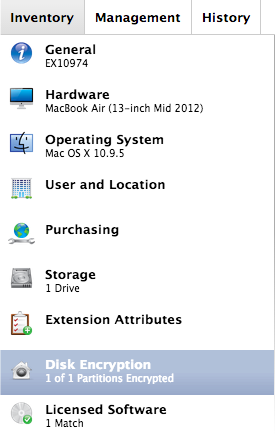
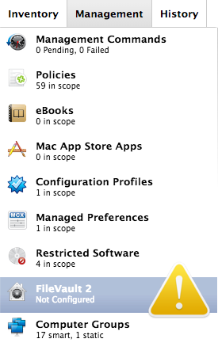
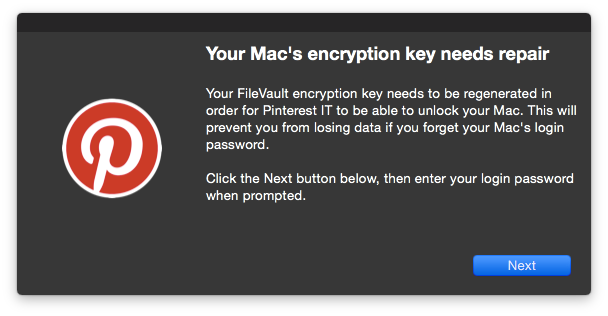
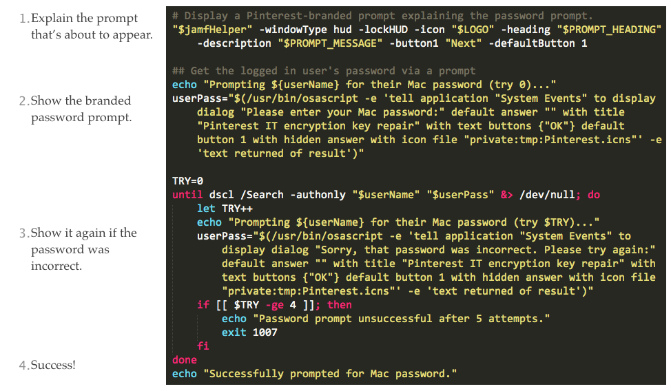

# Reissuing FileVault keys with the Casper Suite

_Presented by Elliot Jordan, Senior Consultant, [Linde Group](http://www.lindegroup.com)_ _MacBrained - January 27, 2015 - San Francisco, CA_

---

## Table of Contents

- [The Problem](#the-problem)
- [The Solution](#the-solution)
    - [Step One: Configuration Profile](#step-one-configuration-profile)
    - [Step Two: Smart Group](#step-two-smart-group)
    - [Step Three: Script](#step-three-script)
        - [reissue_filevault_recovery_key.sh Example Script](https://github.com/homebysix/misc/blob/master/2015-01-27%20MacBrained%20Reissuing%20FileVault%20Keys/reissue_filevault_recovery_key.sh)
    - [Step Four: Policy](#step-four-policy)
    - [Follow Through](#follow-through)

---

## The Problem

__FileVault recovery keys can be missing from the JSS for many reasons.__

- Perhaps the Mac was encrypted prior to enrollment.
- The Mac was encrypted without using Casper. (Using System Preferences or another management framework, for example.)
- The original recovery key was lost due to a bug in Casper or Mac OS X, or due to database corruption.

 &nbsp; 

## The Solution

__You can use a policy to generate a new FileVault key and upload to JSS.__

1. A configuration profile ensures that all FileVault keys are escrowed with the JSS.
2. A smart group determines the computers without valid recovery keys.
3. The reissueKey.sh script can be used as a base, then customized for your environment.
4. A policy deploys the reissueKey.sh script to the computers in the smart group.

### Step One: Configuration Profile

__A configuration profile called “Redirect FileVault keys to JSS” does what the name says.__

- General
    - Distribution Method: __Install Automatically__
    - Level: __Computer Level__
- FileVault Recovery Key Redirection
    - __Automatically redirect recovery keys to the JSS__
- Scope
    - __All computers__

### Step Two: Smart Group

__A smart group named “FileVault encryption key is invalid or unknown” selects the affected Macs.__

| And/Or | Criteria | Operator | Value |
|:-:|:-:|:-:|:-:|
| | FileVault 2 Individual Key Validation | is not | Valid |
| and | Last Check-in | less than x days ago | 30 |
| and | FileVault 2 Detailed Status* | is | FileVault 2 Encryption Complete |

*From Rich Trouton’s FileVault status extension attribute: http://goo.gl/zB04LT

### Step Three: Script

__A customized version of JAMF’s reissueKey.sh script runs on each affected Mac.__

- Start by making a local copy of reissueKey.sh: http://goo.gl/e9HXr3
- Customize as needed for your environment.
    - __Email__ affected employees to give them a heads up.
    - Use __jamfHelper__ to announce the upcoming password prompt.
    - Add __logo__ to AppleScript password prompt.
    - __Fail silently__ if logo files aren’t present, or any other problems detected.
    - __Verify__ the Mac login password, with 5 chances to enter correct password.

Refer to the [example script](https://github.com/homebysix/misc/blob/master/2015-01-27%20MacBrained%20Reissuing%20FileVault%20Keys/reissue_filevault_recovery_key.sh) included in this repo to get you started.

### Step Four: Policy

__A policy called “Reissue invalid or missing FileVault recovery key” runs the script on each Mac in the smart group.__

- General
    - Trigger: __Recurring Check-In__
    - Execution Frequency: __Once per computer__
- Packages
    - __AppleScriptCustomIcon.dmg__ (loads /tmp/Pinterest.icns)
- Scripts
    - __pinterest_reissue_filevault_recovery_key.sh__ (priority: __After__)
- Scope
    - Smart Group: __FileVault encryption key is invalid or unknown__

### Follow Through

__Don’t forget to monitor policy logs and test FileVault recovery to verify success.__

- Monitor logs and flush one-off errors.
 (Unable to connect to distribution point, no user logged in, etc.)
- Identify and resolve remaining problems manually.
- Test a few newly-generated FileVault keys to ensure they are working as expected.
- Update your internal documentation.
 (No, pasting a link to these slides does not count.)

__Thank you!__

---

[Watch the original presentation on Ustream](http://www.ustream.tv/recorded/58111140).
